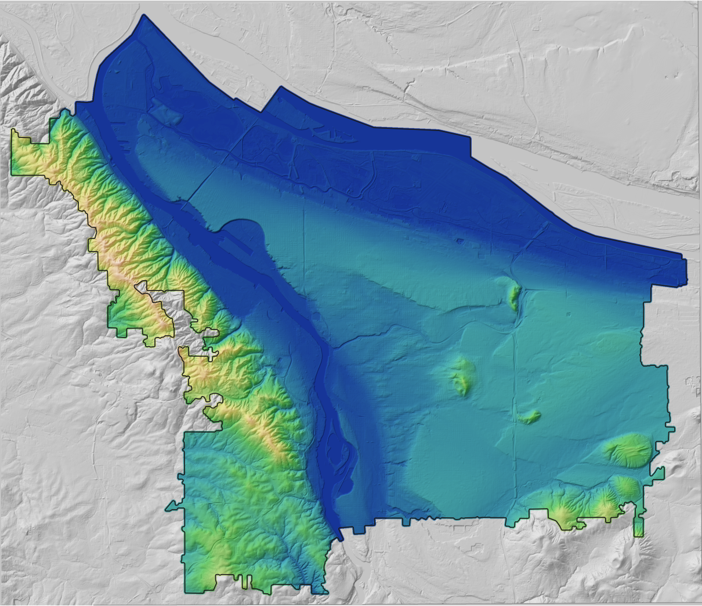
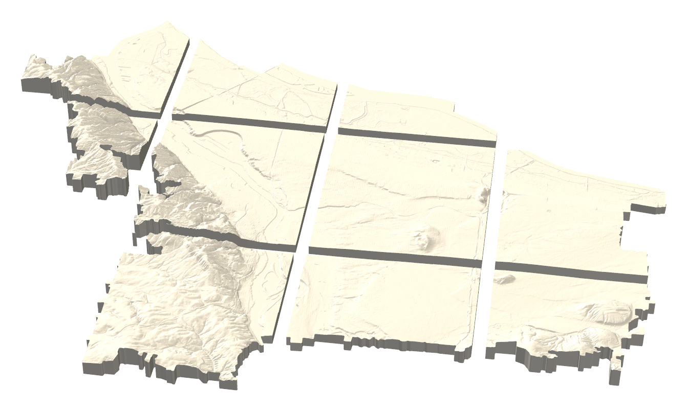
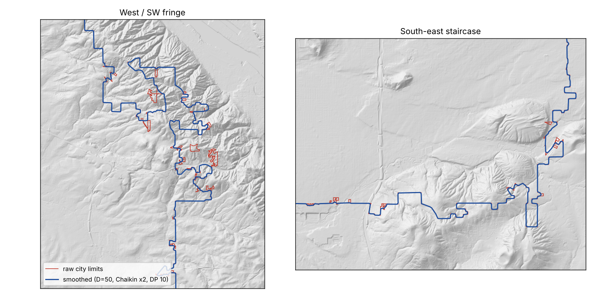

# PortlandTopo

**A tiled, 3D-printed relief map of Portland, Oregon, made from USGS bare-earth lidar and cut to the city-limits outline.**



PortlandTopo is a reproducible pipeline that goes from a public elevation dataset to printable, wall-mountable tiles. Every dimension comes from one parameter script. Every geometry stage checks its own output, and each design decision is logged with the measurement that settled it.

```
29 × 25 km of ground  ·  376 km² inside the city limits  ·  ~362 m of relief  ·  12-tile pilot at 1:92,000
```



---

## What it does

```
USGS 3DEP DEM ──► reproject (EPSG:4269 → UTM 10N) ──► flatten water ──► mask to city limits
     │                                                                          │
Oregon Metro city limits ──► morphological smooth + Chaikin ──► buffered mask ──┘
                                     │
                                     ▼
              resample to print resolution ──► 16-bit heightmaps
              (project-wide normalisation, shared edge pixels)
                                     │
                                     ▼
       Blender, headless: displace ──► extrude skirt ──► boolean against boundary prism
       (every stage is checked for vertex count, non-manifold edges and signed volume)
                                     │
                                     ▼
              watertight per-tile STL ──► Bambu Studio ──► X1 Carbon ──► wall
```

The full operational procedure is in **[RUNBOOK.md](RUNBOOK.md)**.

## Engineering highlights

**One source of truth for every number.** `scripts/topo_params.py` derives scale, tile grid, exaggeration, filament mass, print time and wall load from a handful of constants. The docs embed its output instead of hand-typed figures, so changing one constant and re-running it updates every derived value.

**Tiles that line up at the seams.** Heightmaps are normalised against the project-wide elevation range, never per tile, and each tile is cut with a one-pixel overlap. Neighbouring tiles therefore build their shared edge from identical samples, so the joints show no ridge or gutter.

**A boundary that prints.** Real city limits follow parcel lines and PLSS sections. Douglas-Peucker simplification only deletes vertices, so a staircase stays a staircase. `smooth_boundary.py` uses a morphological open/close at radius *D* to remove features by size, then Chaikin corner-cutting, then a light DP pass. It reports deviation in two directions, *amputation* and *intrusion*, because a single Hausdorff number can't tell lost material from a filled notch. A parameter sweep located a cliff: going from D = 50 m to 75 m moves amputation from 235 m to 1,571 m as a whole limb of the city drops off. The pilot uses D = 50 plus five point-addressed spot edits.



**Check the output, not the settings.** Five separate Blender bugs all showed up the same way: "the tile looks flat". Every setting read correctly and none of them raised an error. Each one now has its own measured check:

| Failure | Check that catches it |
|---|---|
| GeoTIFF texture Blender can't decode | image loads as 0×0 |
| Missing UV layer | evaluated Z span ≈ 0 |
| Relative texture path in saved `.blend` | image packed into the file |
| Inside-out boundary prism | **signed volume** < 0 (an edge-manifold check still passes on a mirror-image solid) |
| Heightmap read as sRGB | peak × strength ≠ evaluated span. The sRGB curve crushed the flats by up to 88% while the hills stayed correct, and an exaggeration value had already been chosen by eye from that distorted model. |

`scripts/boolean_probe.py` locates a failing boolean by testing each operand against a known-good cube. It found a Solidify self-intersection in one run, after four rounds of guessing had failed.

**Cost models over intuition.** Three findings went against the obvious answer:

- *Vertical exaggeration has a cost.* Portland is ~80× wider than it is tall, so relief has to be exaggerated, and filament use and print time grow roughly linearly with it.
- *Colouring by Z is cheap and colouring by XY is not.* Roads follow the terrain, so a coloured road forces a filament change on almost every layer. That costs ~283 g of purge per tile at 2″ of relief, against ~2 g for elevation bands (`color_cost.py`). Roads are engraved and paint-filled instead.
- *Hollowing saves less than it looks like.* Tear-away support costs about as much as the infill it replaces, and a hollow tile's flat terrain turns into unsupported ceilings. `hollow_model.py` picks a ribbed strategy per tile.

**Data that contradicted the docs got measured, then fixed.** 3DEP was documented as arriving in UTM but actually arrives in geographic degrees. The low-elevation constant had a misplaced decimal point. River surfaces turned out to be pre-flattened at three different levels. The 1 m lidar tier requires institutional access. Each of these is a dated entry in [`docs/DECISIONS.md`](docs/DECISIONS.md).

## Repository layout

```
RUNBOOK.md        End-to-end procedure: setup → data → QGIS → Blender → slice → print
docs/             Design specs 00–11, DECISIONS log, OPEN-QUESTIONS, SOURCES
  img/            README figures (generated by tools/render_readme_images.py)
scripts/          The pipeline (Python; Blender scripts run headless via bpy)
csv/              Print logs: tiles.csv, test_prints.csv, filament_log.csv
tools/            Repo utilities that aren't part of the pipeline
10m_hillshade_with_boundary.qgz   QGIS project (relative paths into data/)
```

`data/` holds the DEM, vectors, heightmaps, prisms and STLs. It isn't committed: everything in it is regenerated by the scripts, and `.gitignore` excludes it.

## Scripts

| Script | Role |
|---|---|
| `topo_params.py` | All dimensional math: scale, grid, exaggeration, mass/time budgets (stdlib only) |
| `fetch_dem.py` | Download USGS 3DEP from the OpenTopography API |
| `fetch_pdx_vectors.py` | Streets and bike network from PortlandMaps ArcGIS REST |
| `dem_stats.py` | DEM statistics, unit sanity checks, calibration constants |
| `smooth_boundary.py` | Morphological + Chaikin boundary regularisation, two-way deviation report, spot edits |
| `tile_grid_explore.py` | Fit the tile grid to the boundary and search offsets to avoid sliver tiles |
| `qgis_export_tiles.py` | Project-normalised 16-bit heightmaps with shared edge pixels |
| `boundary_prism.py` | Watertight, correctly wound cutting prism(s), aligned to the heightmap in model mm |
| `custom_tiles.py` | Hand-drawn, arbitrary-shape tiles authored in QGIS |
| `blender_heightmap_to_mesh.py` | Headless Blender: heightmap → displaced, skirted, boolean-cut STL with health checks |
| `boolean_probe.py` | Bisects a failing Blender boolean operand by operand |
| `tile_heights.py` | Printed Z per tile, hollow-strategy recommendation |
| `color_cost.py` | AMS purge-waste model, Z-banding vs XY colour |
| `hollow_model.py` | Material/time model for solid, shell and ribbed bases |

## Status

- **Phase 1, pilot (4×3 grid, 90 mm tiles, 1:92,000, 2.03× exaggeration).** Pipeline complete. Ten boundary-cut tiles are meshed and slicer-costed at 174 g and about 10 h, and the calibration coupons are queued in `csv/test_prints.csv`.
- **Phase 2, final wall.** Size and exaggeration are still open; see [`docs/OPEN-QUESTIONS.md`](docs/OPEN-QUESTIONS.md). The squarest candidate is a 7×6 grid of 200 mm tiles (1392 × 1200 mm, 1:20,833).

## Data and attribution

- Elevation: USGS 3D Elevation Program (3DEP), public domain, via [OpenTopography](https://opentopography.org/)
- City limits: Oregon Metro RLIS, `BoundaryDataWebMerc` layer 0
- Streets and bicycle network: City of Portland Bureau of Transportation, PortlandMaps open data

## License

Code (`scripts/`, `tools/`) is released under the [MIT License](LICENSE). Documentation and figures (`docs/`, `RUNBOOK.md`, this README) are released under [CC BY 4.0](LICENSE-docs.md).
